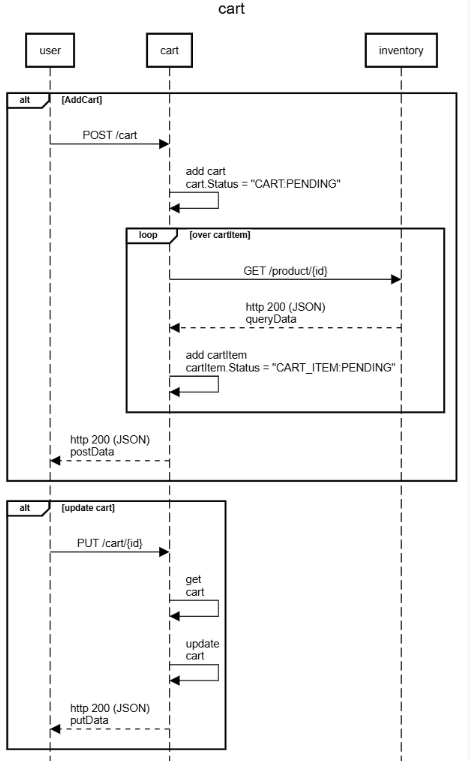
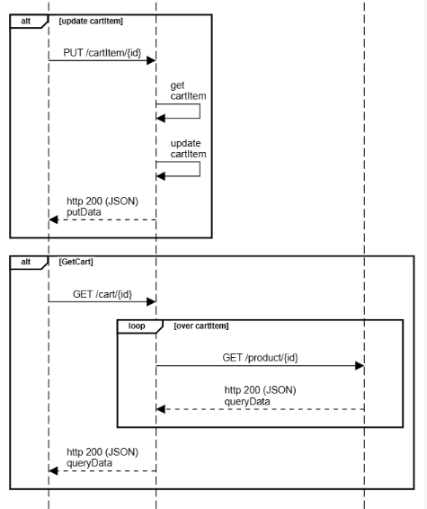

## go-cart

   This is workload for POC purpose such as load stress test, gitaction, etc.

   The main purpose is create an cart and cart item (with products selected).

## Sequence Diagram

    
    title cart

    participant user
    participant cart
    participant inventory

    entryspacing 1.3
        alt AddCart
            user->cart:POST /cart
            postData
    cart->cart:add cart\ncart.Status = "CART:PENDING"
        loop over cartItem
        cart->inventory:GET /product/{id}
        cart<--inventory:http 200 (JSON)\nqueryData
        cart->cart:add cartItem\ncartItem.Status = "CART_ITEM:PENDING"
        end
            user<--cart:http 200 (JSON)\npostData
            queryData
        end
        alt update cart
        user->cart:PUT /cart/{id}
    cart->cart:get\ncart
    cart->cart:update\ncart
    cartItem
        user<--cart:http 200 (JSON)\nputData
        end
        alt update cartItem
        user->cart:PUT /cartItem/{id}
    cart->cart:get\ncartItem
    cart->cart:update\ncartItem
        user<--cart:http 200 (JSON)\nputData
        end
    alt GetCart
    user->cart:GET /cart/{id}
    loop over cartItem
    cart->inventory:GET /product/{id}
    cart<--inventory:http 200 (JSON)\nqueryData
    end
    user<--cart:http 200 (JSON)\nqueryData
    endrt:http 200 (JSON)\nputData
        end

## Enviroment variables

   To run in local machine for local tests creat a .env in /cmd folder

    VERSION=1.0
    ACCOUNT=aws:localhost
    APP_NAME=go-cart.localhost
    PORT=7001
    ENV=dev

    DB_HOST= 127.0.0.1 
    DB_PORT=5432
    DB_NAME=postgres
    DB_MAX_CONNECTION=30
    CTX_TIMEOUT=10

    LOG_LEVEL=info #info, error, warning
    OTEL_EXPORTER_OTLP_ENDPOINT = localhost:4317

    OTEL_METRICS=true
    OTEL_STDOUT_TRACER=false
    OTEL_TRACES=true

    OTEL_LOGS=true
    OTEL_STDOUT_LOG_GROUP=true
    LOG_GROUP=/mnt/c/Eliezer/log/go-cart.log

    NAME_SERVICE_00=go-inventory
    URL_SERVICE_00=http://localhost:7000
    HOST_SERVICE_00=go-inventory
    CLIENT_HTTP_TIMEOUT_00=5

## Enpoints

curl --location 'http://localhost:7004/health'

curl --location 'http://localhost:7004/live'

curl --location 'http://localhost:7004/header'

curl --location 'http://localhost:7004/context'

curl --location 'http://localhost:7004/info'

curl --location 'http://localhost:7004/metrics'

curl --location 'http://localhost:7001/cart/5'

curl --location 'http://localhost:7001/cart' \
    --header 'Content-Type: application/json' \
    --data '{
        "user_id": "eliezer",
        "cart_item": [ 
            {   "product": {
                    "sku": "dental-01"
                },
                "currency": "BRL",
                "quantity": 2,
                "price": 2.5
            },
            {
                "product": {
                    "sku": "floss-01"
                },
                "currency": "BRL",
                "quantity": 3,
                "price": 3.6
            }
        ]
    }'

curl --location --request PUT 'http://localhost:7001/cart/9' \
    --header 'Content-Type: application/json' \
    --data '{
        "status": "TESTE-01"
    }'

curl --location --request PUT 'http://localhost:7001/cartItem/9' \
    --header 'Content-Type: application/json' \
    --data '{
        "status": "TESTE:PRODUCT"
    }'

## Monitoring

Logs: JSON structured logging via zerolog

Metrics: Available through endpoint /metrics via otel/sdk/metric

Trace: The x-request-id is extract from header and is ingest into context, in order the x-request-id do not exist a new one is generated (uuid)

Errors: Structured error handling with custom error types

## Security

Security Headers: Is implement via go-core midleware

## Tables

    CREATE TABLE public.cart (
        id 			BIGSERIAL 	NOT NULL,
        user_id 	VARCHAR(100) NOT NULL,
        status		VARCHAR(100) NOT NULL,
        created_at	timestamptz NOT NULL,
        updated_at	timestamptz NULL,  
        CONSTRAINT cart_pkey PRIMARY KEY (id)
    );

    CREATE TABLE public.cart_item (
        id 				BIGSERIAL	NOT NULL,
        fk_cart_id		BIGSERIAL	NOT NULL,
        fk_product_id	BIGSERIAL	NOT NULL,
        status			VARCHAR(100)	NULL,
        currency		VARCHAR(100)	NULL,
        quantity 		INT 		NOT null DEFAULT 0,
        discount 		DECIMAL(10,2) NOT null DEFAULT 0,
        price 			DECIMAL(10,2) NOT null DEFAULT 0,
        created_at		timestamptz 	NOT NULL,
        updated_at		timestamptz 	NULL,  
        CONSTRAINT cart_item_pkey PRIMARY KEY (id)
    );

    ALTER TABLE public.cart_item ADD constraint cart_item_fk_cart_id_fkey 
    FOREIGN KEY (fk_cart_id) REFERENCES public.cart(id);

    ALTER TABLE public.cart_item ADD CONSTRAINT cart_item_fk_product_id_fkey 
    FOREIGN KEY (fk_product_id) REFERENCES public.product(id);

